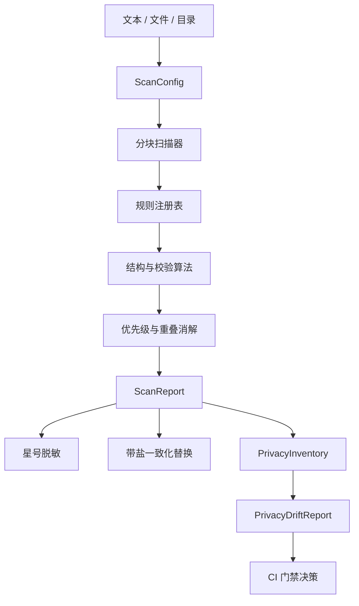

# 架构与数据流

## 设计目标

墨隐以“原文最小暴露”为首要约束：扫描、校验、替换和基线比较均由本地 MoonBit 引擎完成。JavaScript 仅负责文件访问、界面渲染和命令行交互。

核心目标：

1. 同一检测行为可复用于浏览器、CLI 和未来的编辑器插件。
2. 规则结果可解释，可指出类型、风险、范围和原因。
3. 面对无效号码、普通数字和重叠规则时降低误报。
4. 支持大文本、策略配置和自动化门禁。
5. 可保存审计结果而不保存敏感原文。

## 组件

### `config.mbt`

定义扫描策略和规则元数据。调用者可选择分类、是否包含低风险结果、自定义词、结果数量上限和分块大小。空分类列表表示启用全部规则。

### `engine.mbt`

包含基础检测器、校验算法、候选结果排序、区间冲突解决、分块拼接和替换生成。候选项先按开始位置、优先级和长度排序，再保证一个字符区间只接受一个结果。

### `rules_extended.mbt`

扩展座机、机动车号牌、MAC、JWT、URL 内嵌凭据、PEM 私钥和自定义敏感词。规则尽量要求明确边界或最小结构，避免把普通文本误识别为凭据。

### `governance.mbt`

将普通扫描报告压缩成不含原文的隐私清单，再比较基线和候选清单。带盐指纹用于判断两次扫描是否命中同一值，变化分为：

- `new`：候选中首次出现；
- `increased`：同一值出现次数增加；
- `persistent`：两次保持一致；
- `decreased`：出现次数减少；
- `resolved`：候选中已经消失。

默认门禁策略会阻止新增高风险信息，也可由库调用者构建自定义 `DriftPolicy`。

### JavaScript 适配层

`moyin.mbt` 导出稳定的 ESM 接口。`web/` 和 `cli/` 只消费 JSON，不重新实现规则。`scripts/build.mjs` 负责编译 MoonBit release 产物并复制网页静态资源。

## 数据结构

`ScanReport` 包含原文片段和脱敏预览，只适合在受控环境中即时查看。`PrivacyInventory` 与 `PrivacyDriftReport` 不包含原文，适合成为 CI artifact 或版本趋势数据。

匿名指纹格式为 `mi_<category>_<stable-code>`。它是范围内的关联标识，不是密码哈希。使用不同盐值可阻止不同项目直接关联同一原文。

## 分块扫描

超出 `chunk_size` 的文本会被切成逻辑块，并在块边界增加重叠窗口。每个候选结果重新映射到全局 UTF-16 位置，随后统一去重。该设计避免复制完整输入到多个规则，同时覆盖跨块的手机号、JWT 和密钥。

## 扩展规则

新增规则的一般步骤：

1. 在 `available_rules()` 注册分类、标签、风险和说明。
2. 在独立函数中产生内部 `Candidate`。
3. 给规则设置与精确度相符的优先级。
4. 在 `collect_segment_candidates()` 接入。
5. 添加正例、反例、边界、重叠和分块测试。
6. 执行 `moon info && moon fmt && moon test --target js`。

